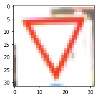
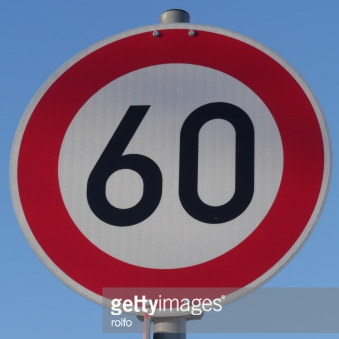
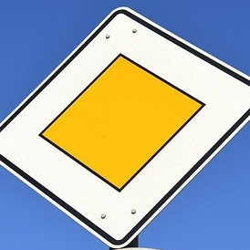
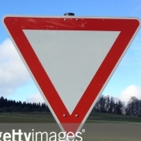
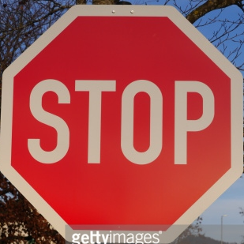

#**Traffic Sign Recognition** 

**Build a Traffic Sign Recognition Project**

The goals / steps of this project are the following:
* Load the data set (see below for links to the project data set)
* Explore, summarize and visualize the data set
* Design, train and test a model architecture
* Use the model to make predictions on new images
* Analyze the softmax probabilities of the new images
* Summarize the results with a written report

## Rubric Points
###Here I will consider the [rubric points](https://review.udacity.com/#!/rubrics/481/view) individually and describe how I addressed each point in my implementation.  

---
###Data Set Summary & Exploration

####1. Provide a basic summary of the data set and identify where in your code the summary was done. In the code, the analysis should be done using python, numpy and/or pandas methods rather than hardcoding results manually.

The code for this step is contained in the second code cell of the IPython notebook.  

I used the standard python and the numpy library to calculate summary statistics of the traffic
signs data set:

* The size of training set is 34799
* The size of test set is 12630
* The shape of a traffic sign image is (32,32,3)
* The number of unique classes/labels in the data set is 43

####2. Include an exploratory visualization of the dataset and identify where the code is in your code file.

The code for this step is contained in the third code cell of the IPython notebook.  

Here is an exploratory visualization of the data set. It is a image of traffic sign before preprocessing. All images are in color and 32 by 32 pixels large.

###Design and Test a Model Architecture

####1. Describe how, and identify where in your code, you preprocessed the image data. What tecniques were chosen and why did you choose these techniques? Consider including images showing the output of each preprocessing technique. Pre-processing refers to techniques such as converting to grayscale, normalization, etc.

The code for this step is contained in the fourth and fith code cell of the IPython notebook.

I decided to only normalize the image in the sence that the maximum value of in each color for a single image is 255 and the minimum 0. This was done in order to make the lighting level more similar between pictures. The network was able to train on it but I realised that this method wasn't very good as it depended only on the lightest and darkest pixel for each color, but I did not change it as the network gave decent results anyway.

####2. Describe how, and identify where in your code, you set up training, validation and testing data. How much data was in each set? Explain what techniques were used to split the data into these sets. (OPTIONAL: As described in the "Stand Out Suggestions" part of the rubric, if you generated additional data for training, describe why you decided to generate additional data, how you generated the data, identify where in your code, and provide example images of the additional data)

I used the training, validation and test set given in the pickle files.
Number of training examples = 34799
Number of validation examples = 4410
Number of testing examples = 12630

####3. Describe, and identify where in your code, what your final model architecture looks like including model type, layers, layer sizes, connectivity, etc.) Consider including a diagram and/or table describing the final model.

The code for my final model is located in the sixth cell of the ipython notebook. 

My final model consisted of the following layers:

| Layer         		|     Description	        					| 
|:---------------------:|:---------------------------------------------:| 
| Input         		| 32x32x3 RGB image   							| 
| Convolution 5x5     	| 1x1 stride, valid padding, outputs 28x28x12 	|
| Sigmoid    			|												|
| Dropout layer 		|                               				|
| Average pooling		| 2x2 stride,  outputs 14x14x12 				|
| Convolution 5x5     	| 1x1 stride, valid padding, outputs 10x10x25 	|
| Sigmoid    			|												|
| Average pooling		| 2x2 stride,  outputs 5x5x25    				|
| Dropout layer 		|                               				|
|Flatten         		|outputs 625 							     	|
| Fully connected		|input 625,  outputs 150       					|
| Sigmoid    			|												|
| Dropout layer 		|                               				|
| Fully connected		|input 150,  outputs 100       					|
| Sigmoid    			|												|
| Fully connected		|input 100,  outputs 43       					|
| Softmax				|                    							|
 

####4. Describe how, and identify where in your code, you trained your model. The discussion can include the type of optimizer, the batch size, number of epochs and any hyperparameters such as learning rate.

The code for training the model is located in the seventh to tenth cell of the ipython notebook. 

To train the model, I used a learning rate of 0.0005, 800 epochs and a batch size of 8192. During training the keep-probablility for the dropout layer was 0.5.

I used an AdamOptimizer and the code I used for training is an only slightly modified version of what was used in the previous LeNet examples.

####5. Describe the approach taken for finding a solution. Include in the discussion the results on the training, validation and test sets and where in the code these were calculated. Your approach may have been an iterative process, in which case, outline the steps you took to get to the final solution and why you chose those steps. Perhaps your solution involved an already well known implementation or architecture. In this case, discuss why you think the architecture is suitable for the current problem.

The code for calculating the accuracy of the model is located in the eleventh cell of the Ipython notebook.

My final model results were:
* training set accuracy of 99.4%
* validation set accuracy of 96.8%
* test set accuracy of 95.0%

I started with a copy of the LeNet architecture from the previous examples. This is due to that is sounded reasonable to start with convolusional layers to learn features in the image and then fully connected layers to use the feature map instead of the picture.

I modified the depth of the two convolusional layers and changed the number of units in the fully connected layers. In addition to this I used a sigmoid activation function instead of RELU for all layers. The depth and number of units in each layer was tuned by testing different values. When doing the last optional task of showing the output from the first convolusional layer I noticed that some feature maps looked the same so I reduced the depth from the first layer and increased it on my second convolusional layer.

During training I did also add 3 dropout layers to reduce any overfitting problems. I guess I still have some as the number of incorrect predictions in the training set is a lot lower than in the validation and test set.

Both the number of epochs, learning rate and drop probablity was tuned in order to reduce overfitting. Reduced learning and increased drop probability meant that I needed more epochs. 

###Test a Model on New Images

####1. Choose five German traffic signs found on the web and provide them in the report. For each image, discuss what quality or qualities might be difficult to classify.

Here are five German traffic signs that I found on the web:

They are all good representation of german traffic signs but it was hard to find examples using google that would be difficult to classify. 

Some of them have some overlaying text but that should probably not be a problem as they as shrunk to 32x32 pixels before processing. The priority road sign might be difficult as some of the sign is outside of the image but for all others the sign is clearly visible with a rather distinct background.

####2. Discuss the model's predictions on these new traffic signs and compare the results to predicting on the test set. Identify where in your code predictions were made. At a minimum, discuss what the predictions were, the accuracy on these new predictions, and compare the accuracy to the accuracy on the test set (OPTIONAL: Discuss the results in more detail as described in the "Stand Out Suggestions" part of the rubric).

The code for making predictions on my final model is located in the thirteenth cell of the Ipython notebook.

Here are the results of the prediction:

| Image			        |     Prediction	        					| 
|:---------------------:|:---------------------------------------------:| 
| Priority road    		| Priority road									| 
| Speed limit (60km/h)  | Speed limit (60km/h) 							|
| Keep right			| Keep right									|
| Stop 	         		| Stop      					 				|
| Yield      			| Yield      							        |

The model was able to correctly guess 5 of the 5 traffic signs, which gives an accuracy of 80%. This compares favorably to the accuracy on the test set of 95%.

####3. Describe how certain the model is when predicting on each of the five new images by looking at the softmax probabilities for each prediction and identify where in your code softmax probabilities were outputted. Provide the top 5 softmax probabilities for each image along with the sign type of each probability. (OPTIONAL: as described in the "Stand Out Suggestions" part of the rubric, visualizations can also be provided such as bar charts)

The code for making predictions on my final model is located in the 15th cell of the Ipython notebook.

For the first image (Priority road) the top five soft max probabilities were

| Probability         	|     Prediction	        					| 
|:---------------------:|:---------------------------------------------:| 
| .998         			| Priority road   								| 
| .0007     			| No entry 									    |
| .0001					| End of all speed and passing limits	        |
| .00007	      		| Yield		     			 		     		|
| .00006			    | Stop             							    |

For the second image (Speed limit (60km/h)) the top five soft max probabilities were

| Probability         	|     Prediction	        					| 
|:---------------------:|:---------------------------------------------:| 
| .997          		| Speed limit (60km/h)   						| 
| .027     		    	| Speed limit (80km/h) 							|
| .004					| Speed limit (50km/h)                 		    |
| .0001	         		| Ahead only		     		 				|
| .0001		            | Speed limit (30km/h)      					|

For the third image (Keep right) the top five soft max probabilities were

| Probability         	|     Prediction	        					| 
|:---------------------:|:---------------------------------------------:| 
| .996         			| Keep right   							    	| 
| .003      			| Turn left ahead 							    |
| .0003					| End of all speed and passing limits	        |
| .0002 	       		| Go straight or right	     		     		|
| .0001 			    | Children crossing							    |

For the forth image (Stop) the top five soft max probabilities were

| Probability         	|     Prediction	        					| 
|:---------------------:|:---------------------------------------------:| 
| .996         			| Stop   					        			| 
| .002      			| No entry 									    |
| .0003					| Yield	   							            |
| .0002 	      		| Priority road		     			      		|
| .0001 			    | No passing for vehicles over 3.5 metric tons  |

For the fith image (Yield) the top five soft max probabilities were

| Probability         	|     Prediction	        					| 
|:---------------------:|:---------------------------------------------:| 
| .999         			| Yield   			        					| 
| .00009     			| No vehicles 								    |
| .00007				| Go straight or right	                        |
| .00003	      		| Priority road		     			 	 		|
| .00001			    | Bumpy road             					    |

It seems that for these potentially very clear picture the trained network is very confident in its guesses.
